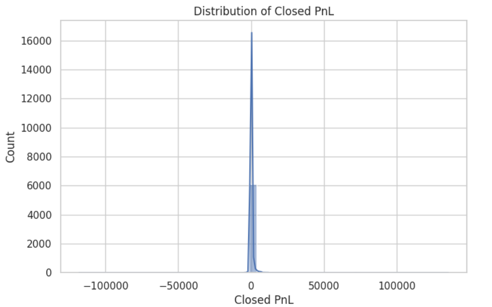
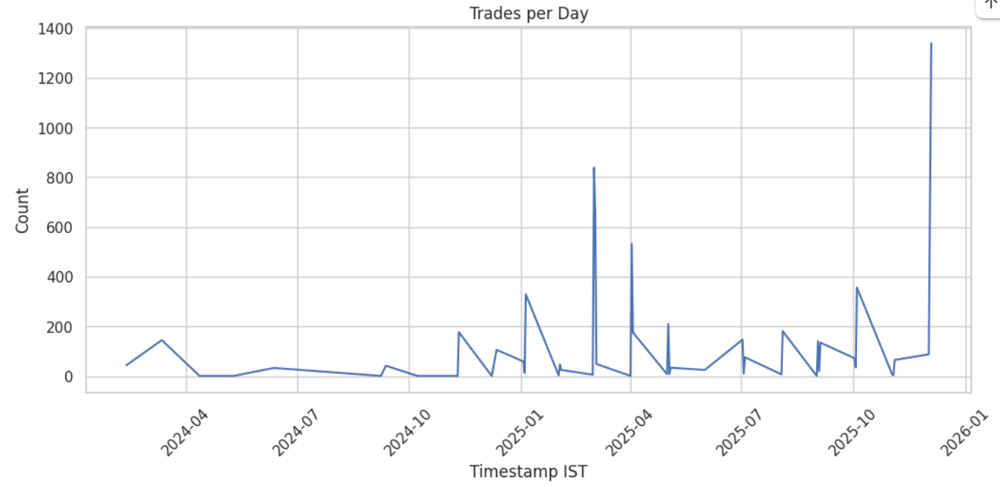
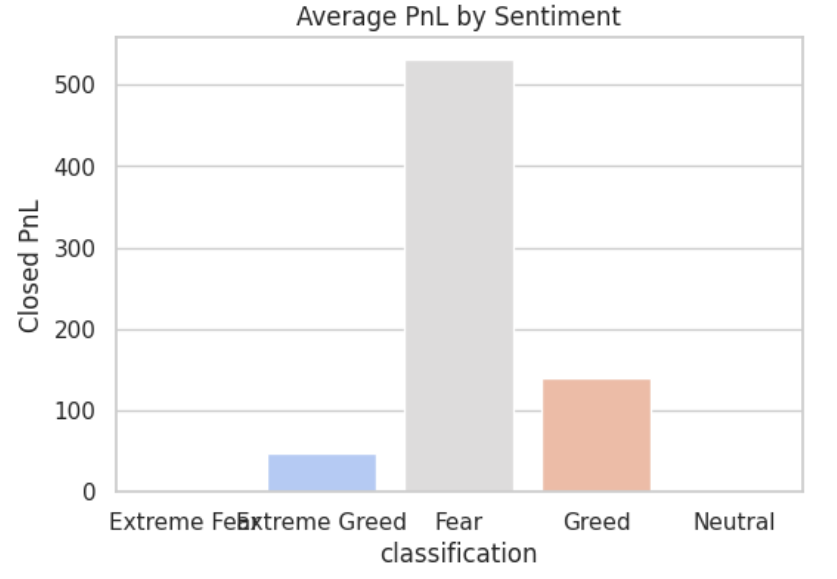
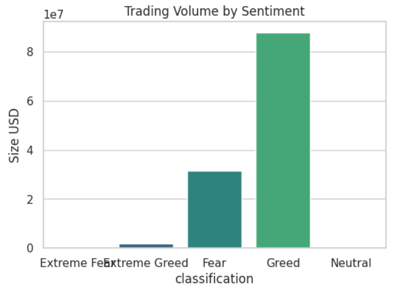
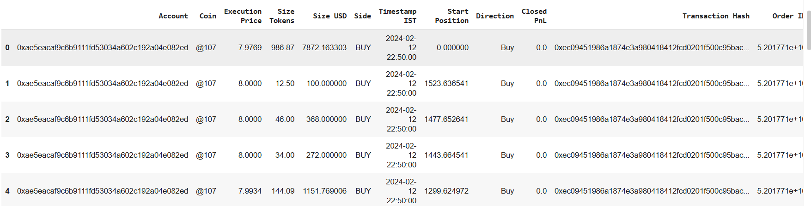

# Fear & Greed Index vs Trader Performance  

## Overview  
This project analyzes the relationship between **Bitcoin market sentiment (Fear/Greed)** and **trader performance** on Hyperliquid.  
The goal is to understand how sentiment impacts trading behavior, profitability, and volume.  

## Repository Structure  
ds_rajat_gupta/
├── notebook_1.ipynb # Main analysis notebook
├── csv_files/ # Raw datasets
│ └── fear_greed_index.csv
├── outputs/ # Visuals & processed files
│ ├── eda.png
│ ├── scatterplot.png
│ ├── pnl_barplot.png
│ ├── volume_barplot.png
│ ├── merged_dataset.csv
│ └── merged_dataset.png # Screenshot of merged dataset preview
├── ds_report.pdf # Final summarized report
└── README.md # Project documentation

## Methodology  
1. **Data Preprocessing**  
   - Converted timestamps  
   - Cleaned missing values  
   - Merged trade data with sentiment data  

2. **Exploratory Data Analysis (EDA)**  
   - PnL distribution  
   - Daily trading activity  
   - Sentiment-wise patterns  

3. **Performance Comparison**  
   - Avg PnL under Fear vs Greed  
   - Trading volume differences  
   - Correlation between sentiment and profitability  

## Results & Visuals  

### PnL Distribution (EDA)  
  

### Trades per Day  
  

### Average PnL by Sentiment  
  

### Trading Volume by Sentiment  
  

---

## 📑 Key Insights  
- **Fear periods** → Higher average PnL (~531), lower total volume (~31.6M).  
- **Greed periods** → Lower average PnL (~139), higher total volume (~87.9M).  
- Weak correlation (–0.05) between sentiment and profitability → sentiment alone cannot predict success.  

---

## About the Datasets  
- `csv_files/fear_greed_index.csv` → Sentiment dataset (Fear/Greed).  
- `outputs/merged_dataset.csv` → Final dataset used for analysis (includes trades + sentiment).  
> The original `historical_data.csv` file was very large, so it has not been uploaded to this repository.  
> It can be accessed from the original Google Drive link provided in the assignment.  

### Sample of Merged Dataset  
Here’s a preview of the final dataset after merging trades with sentiment:  

  

---

## How to Run  
1. Clone this repository:  
   ```bash
   git clone https://github.com/<your-rajatrgupta>/ds_rajat_gupta.git
